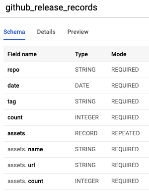

```asciiarmor
┌──────────────────────────┐
│                          │
│  Google Cloud Scheduler  │
│                          │
└────────────┬─────────────┘
             │                             ┌─────────────────────┐
             │                             │                     │
┌────────────▼─────────────┐   ┌───────────►  GitHub API Server  │
│                          │   │           │                     │
│  Google Cloud Functions  ├───┤           └─────────────────────┘
│                          │   │
└────────────┬─────────────┘   │           ┌─────────────────────────┐
             │                 │           │                         │
             │                 ├───────────►  Docker Hub API Server  │
   ┌─────────▼─────────┐       │           │                         │
   │                   │       │           │                         │
   │  Google BigQuery  │       │           └─────────────────────────┘
   │                   │       ├───────────► ...                   
   └─────────▲─────────┘       │           ┌──────────────────┐
             │                 │           │                  │
             │                 └───────────►  Aliyun OSS API  │
  ┌──────────┴───────────┐                 │                  │
  │                      │                 └──────────────────┘
  │  Google Data Studio  │
  │       ┌──┐           │
  │  ┌──┐ │  │ ┌──┐      │
  │  │  │ │  │ │  │      │
  │  │  │ │  │ │  │      │
  └──┴──┴─┴──┴─┴──┴──────┘
```


[TOC]

## API Explorations

### Github API

ref: https://pygithub.readthedocs.io/en/latest/examples/MainClass.html

#### Get Repo

```python
g = Github(login_or_token=token, timeout=60, retry=Retry(
           total=10, status_forcelist=(500, 502, 504), backoff_factor=0.3))
org_str = "vesoft-inc"
org = g.get_organization(org_str)
repos = org.get_repos()

list(repos)
[Repository(full_name="vesoft-inc/nebula"),
 Repository(full_name="vesoft-inc/nebula-docs"),
 Repository(full_name="vesoft-inc/nebula-dev-docker"),
 Repository(full_name="vesoft-inc/github-statistics"),
 Repository(full_name="vesoft-inc/nebula-docker-compose"),
 Repository(full_name="vesoft-inc/nebula-go"),
 Repository(full_name="vesoft-inc/nebula-java"),
 Repository(full_name="vesoft-inc/nebula-python"),
 Repository(full_name="vesoft-inc/nebula-importer"),
 Repository(full_name="vesoft-inc/nebula-third-party"),
 Repository(full_name="vesoft-inc/nebula-storage"),
 Repository(full_name="vesoft-inc/nebula-graph"),
 Repository(full_name="vesoft-inc/nebula-common"),
 Repository(full_name="vesoft-inc/nebula-stats-exporter"),
 Repository(full_name="vesoft-inc/nebula-web-docker"),
 Repository(full_name="vesoft-inc/nebula-bench"),
 Repository(full_name="vesoft-inc/nebula-console"),
 Repository(full_name="vesoft-inc/nebula-docs-cn"),
 Repository(full_name="vesoft-inc/nebula-chaos"),
 Repository(full_name="vesoft-inc/nebula-clients"),
 Repository(full_name="vesoft-inc/nebula-spark-utils"),
 Repository(full_name="vesoft-inc/nebula-node"),
 Repository(full_name="vesoft-inc/nebula-rust"),
 Repository(full_name="vesoft-inc/nebula-cpp"),
 Repository(full_name="vesoft-inc/nebula-http-gateway"),
 Repository(full_name="vesoft-inc/nebula-flink-connector"),
 Repository(full_name="vesoft-inc/nebula-community"),
 Repository(full_name="vesoft-inc/nebula-br"),
 Repository(full_name="vesoft-inc/.github")]
```

#### Get Clones Traffic

Note, clone traffic API doesn't provide historical accumulation for counts, but only 15 days stats instead...

```python
In [16]: repo0.get_clones_traffic()
Out[16]:
{'count': 362,
 'uniques': 150,
 'clones': [Clones(uniques=5, timestamp=2021-04-06 00:00:00, count=16),
  Clones(uniques=8, timestamp=2021-04-07 00:00:00, count=23),
  Clones(uniques=13, timestamp=2021-04-08 00:00:00, count=30),
  Clones(uniques=33, timestamp=2021-04-09 00:00:00, count=45),
  Clones(uniques=2, timestamp=2021-04-10 00:00:00, count=13),
  Clones(uniques=6, timestamp=2021-04-11 00:00:00, count=19),
  Clones(uniques=15, timestamp=2021-04-12 00:00:00, count=28),
  Clones(uniques=40, timestamp=2021-04-13 00:00:00, count=54),
  Clones(uniques=9, timestamp=2021-04-14 00:00:00, count=21),
  Clones(uniques=10, timestamp=2021-04-15 00:00:00, count=34),
  Clones(uniques=10, timestamp=2021-04-16 00:00:00, count=23),
  Clones(uniques=5, timestamp=2021-04-17 00:00:00, count=17),
  Clones(uniques=2, timestamp=2021-04-18 00:00:00, count=13),
  Clones(uniques=9, timestamp=2021-04-19 00:00:00, count=23),
  Clones(uniques=3, timestamp=2021-04-20 00:00:00, count=3)]}
```

#### Get View Traffic

Note, view traffic API doesn't provide historical accumulation for counts, but only 15 days stats instead...

```python
In [17]: repo0.get_views_traffic()
Out[17]:
{'count': 6019,
 'uniques': 1134,
 'views': [View(uniques=52, timestamp=2021-04-06 00:00:00, count=169),
  View(uniques=143, timestamp=2021-04-07 00:00:00, count=569),
  View(uniques=152, timestamp=2021-04-08 00:00:00, count=635),
  View(uniques=134, timestamp=2021-04-09 00:00:00, count=648),
  View(uniques=81, timestamp=2021-04-10 00:00:00, count=318),
  View(uniques=42, timestamp=2021-04-11 00:00:00, count=197),
  View(uniques=127, timestamp=2021-04-12 00:00:00, count=515),
  View(uniques=149, timestamp=2021-04-13 00:00:00, count=580),
  View(uniques=134, timestamp=2021-04-14 00:00:00, count=762),
  View(uniques=141, timestamp=2021-04-15 00:00:00, count=385),
  View(uniques=113, timestamp=2021-04-16 00:00:00, count=284),
  View(uniques=48, timestamp=2021-04-17 00:00:00, count=168),
  View(uniques=35, timestamp=2021-04-18 00:00:00, count=135),
  View(uniques=124, timestamp=2021-04-19 00:00:00, count=492),
  View(uniques=59, timestamp=2021-04-20 00:00:00, count=162)]}
```


#### Get Releases

##### Releases

```python
In [31]: for rel in repo0.get_releases():
    ...:     print(rel)
GitRelease(title="Nebula Graph v1.2.1")
GitRelease(title="Nebula Graph v1.2.0")
GitRelease(title="Nebula Graph V1.1.0")
GitRelease(title="Nebula Graph v1.0.1")
GitRelease(title="V1.0.0 GA")
GitRelease(title="Nebula Graph v1.0.0-RC4")
GitRelease(title="Nebula Graph v1.0.0-RC3")
GitRelease(title="Nebula Graph Release v1.0.0-RC2")
GitRelease(title="Nebula Graph v1.0.0-rc1")
GitRelease(title="Nebula Graph v1.0.0-beta")
GitRelease(title="Nebula Graph v0.1.0")
```

##### Tag and its assets

```python
In [33]: release_121 = rels[0]

In [34]: release_121.tag_name
Out[34]: 'v1.2.1'

In [35]: release_121.get_assets()
Out[35]: <github.PaginatedList.PaginatedList at 0x1031edb80>

In [36]: assets = list(release_121.get_assets())

In [37]: assets
Out[37]:
[GitReleaseAsset(url="https://api.github.com/repos/vesoft-inc/nebula/releases/assets/35056357"),
 GitReleaseAsset(url="https://api.github.com/repos/vesoft-inc/nebula/releases/assets/35056361"),
...
 GitReleaseAsset(url="https://api.github.com/repos/vesoft-inc/nebula/releases/assets/35056456")]
```

##### Asset download count

```python
In [40]: assets[0].browser_download_url
Out[40]: 'https://github.com/vesoft-inc/nebula/releases/download/v1.2.1/nebula-1.2.1.el6-5.x86_64.rpm'

In [41]: assets[0].download_count
Out[41]: 0

In [43]: assets[0].name
Out[43]: 'nebula-1.2.1.el6-5.x86_64.rpm'
```

### DockerHub API

#### Get Repos

```python
In [47]: dh_client = DockerHubClient()

In [48]: dh_r = dh_client.get_repos("vesoft")
  
In [54]: dh_r['code']
Out[54]: 200

In [55]: dh_r['content'].keys()
Out[55]: dict_keys(['count', 'next', 'previous', 'results'])

  
In [58]: dh_r['content']['results'][0]
Out[58]:
{'user': 'vesoft',
 'name': 'nebula-graphd',
 'namespace': 'vesoft',
 'repository_type': 'image',
 'status': 1,
 'description': 'Nebula Graph Graphd Service Image. https://github.com/vesoft-inc/nebula',
 'is_private': False,
 'is_automated': False,
 'can_edit': False,
 'star_count': 2,
 'pull_count': 223494,
 'last_updated': '2021-04-19T19:04:20.324010Z',
 'is_migrated': False,
 'collaborator_count': 0,
 'affiliation': None,
 'hub_user': 'vesoft'}
```


### Aliyun OSS API(TBD)


## Data ETL, BigQuery and GCS

### Design Schema

ref: https://cloud.google.com/bigquery/docs/nested-repeated


### Create Table from BigQuery

- table: `github_clone_records`


- table: `github_release_records`



- table: `dockerhub_image_records`


### Load JSON files to BigQuery

Assumptions, files should be stored in GCS, then, to be loaded to BigQuery.

As below, GSC will be used for:

1. As conf file bucket
2. As Archive Bucket in JSON files
3. As BigQuery Data Loading JSON files Source

```asciiarmor

                                              ┌─────────────────────┐
                                              │                     │
   ┌──────────────────────────┐   ┌───────────►  GitHub API Server  │
   │                          │   │           │                     │
   │  Google Cloud Functions  ◄───►           └─────────────────────┘
   │                          │   │
   └────────────▲─────────────┘   │           ┌─────────────────────────┐
                │                 │           │                         │
                │                 ├───────────►  Docker Hub API Server  │
   ┌────────────▼────────────┐    │           │                         │
   │                         │    │           │                         │
   │  Google Cloud Storage   │    │           └─────────────────────────┘
   │                         │    ...
   └────────────┬────────────┘    │           ┌──────────────────┐
                │                 │           │                  │
                │                 └───────────►  Aliyun OSS API  │
      ┌─────────▼─────────┐                   │                  │
      │                   │                   └──────────────────┘
      │  Google BigQuery  │
      │                   │
      └───────────────────┘
```


#### GCS file structure

- Bucket Name: `nebula-insights`
  - https://console.cloud.google.com/storage/browser/nebula-insights/
- Conf Folder: `/conf`
  - https://console.cloud.google.com/storage/browser/nebula-insights/conf?project=nebula-insights
- Data Archive Folder: `/records` 
  - https://console.cloud.google.com/storage/browser/nebula-insights/records?project=nebula-insights

How data is planned to be placed?

```bash
/records/2021-04-21/github_clone_stats.json
/records/2021-04-21/github_release_stats.json
/records/2021-04-21/dockerhub_image_stats.json
```

### JSON file structure

Ref: https://cloud.google.com/bigquery/docs/loading-data-cloud-storage-json#loading_nested_and_repeated_json_data

This is an example of file in `/records/2021-04-21/github_release_stats.json`, it should be put in seperated lines like this:

```json
{"repo":"foo","date":"2021-01-22","tag":"v2.0.1","count":"3","assets":[{"name":"a.deb","url":"http://a.com/a.deb","count":"1"},{"name":"a.rpm","url":"http://a.com/a.rpm","count":"2"}]}
// newline
{"repo":"bar","date":"2021-01-22","tag":"v2.0.1","count":"7","assets":[{"name":"c.deb","url":"http://a.com/c.deb","count":"3"},{"name":"d.rpm","url":"http://a.com/d.rpm","count":"4"}]}
```

And in a pretty view it's like this:

```json
{
    "repo": "foo",
    "date": "2021-01-22",
    "tag": "v2.0.1",
    "count": "3",
    "assets": [
        {
            "name": "a.deb",
            "url": "http://a.com/a.deb",
            "count": "1"
        },
        {
            "name": "a.rpm",
            "url": "http://a.com/a.rpm",
            "count": "2"
        }
    ]
}
// newline
{
    "repo": "bar",
    "date": "2021-01-22",
    "tag": "v2.0.1",
    "count": "7",
    "assets": [
        {
            "name": "c.deb",
            "url": "http://a.com/c.deb",
            "count": "3"
        },
        {
            "name": "d.rpm",
            "url": "http://a.com/d.rpm",
            "count": "4"
        }
    ]
}
```

### Data Conversion into JSON

In Chapter Reference, data format example was put there.

They should be converted into above JSON file lines.

## Pipline Hands on records

### GCP SDK

Install GCP SDK/CLI referring to https://cloud.google.com/sdk/docs/install

### Scheduler Job(based on GAE) Creation

```bash
$ ~~gcloud app create~~
```

Create Jobs in cloudscheduler console: https://console.cloud.google.com/cloudscheduler

### Pub/Sub Creation

```bash
$ gcloud pubsub topics create nebula-insights-cron-topic

$ gcloud pubsub subscriptions create cron-sub --topic nebula-insights-cron-topic
```

### Functions Creation

Corralate function to Pub/Sub Trigerring


### Put code inside a Google Cloud Function:


#### Create BigQuery Table

```bash
$ bq mk -d --data_location=asia-east2 nebula_insights
$ bq ls
    datasetId
 ----------------
  nebulainsights
```


## References

### Dockerhub Data Dict Example

```json
{'vesoft/nebula-graphd': 223560,
 'vesoft/nebula-metad': 215195,
 'vesoft/nebula-storaged': 193011,
 'vesoft/nebula-dev': 77906,
 'vesoft/nebula-console': 5549,
 'vesoft/nebula-importer': 5352,
 'vesoft/nebula-graph-studio': 5220,
 'vesoft/nebula-http-gateway': 2849,
 'vesoft/nebula-http-client': 2168,
 'vesoft/nebula-stats-exporter': 548,
 'vesoft/nebula-data-init': 389,
 'vesoft/nebula-tools': 118,
 'vesoft/nebula-graph-http': 110,
 'vesoft/third-party-build': 68,
 'vesoft/nebula-dashboard': 45,
 'vesoft/nebula-web-console': 12,
 'vesoft/provider': 6}
```

### Github Data Dict Example

```json
{
	'vesoft-inc/nebula': {
		'clones': {
			'2021-04-07': 18,
			'2021-04-08': 30,
			'2021-04-09': 45,
			'2021-04-10': 13,
			'2021-04-11': 19,
			'2021-04-12': 28,
			'2021-04-13': 54,
			'2021-04-14': 21,
			'2021-04-15': 34,
			'2021-04-16': 23,
			'2021-04-17': 17,
			'2021-04-18': 13,
			'2021-04-19': 23,
			'2021-04-20': 28
		},
		'releases': {
			'v1.2.1': {
				'nebula-1.2.1.el6-5.x86_64.rpm': 0,
				'nebula-1.2.1.el7-5.x86_64.rpm': 14,
				'nebula-1.2.1.el8.x86_64.rpm': 0,
				'nebula-1.2.1.ubuntu1604.x86_64.deb': 0,
				'nebula-1.2.1.ubuntu1804.x86_64.deb': 5,
				'nebula-1.2.1.ubuntu2004.x86_64.deb': 1
			},
			'v1.2.0': {
				'nebula-1.2.0.el6-5.x86_64.rpm': 32,
				'nebula-1.2.0.el7-5.x86_64.rpm': 201,
				'nebula-1.2.0.el8.x86_64.rpm': 41,
				'nebula-1.2.0.ubuntu1604.amd64.deb': 21,
				'nebula-1.2.0.ubuntu1804.amd64.deb': 40,
				'nebula-1.2.0.ubuntu2004.amd64.deb': 36
			},
			'v1.1.0': {
				'nebula-1.1.0.el6-5.x86_64.rpm': 72,
				'nebula-1.1.0.el7-5.x86_64.rpm': 125,
				'nebula-1.1.0.ubuntu1604.amd64.deb': 23,
				'nebula-1.1.0.ubuntu1804.amd64.deb': 28
			},
			'v1.0.1': {
				'nebula-1.0.1.el6-5.x86_64.rpm': 28,
				'nebula-1.0.1.el7-5.x86_64.rpm': 127,
				'nebula-1.0.1.ubuntu1604.amd64.deb': 18,
				'nebula-1.0.1.ubuntu1804.amd64.deb': 39
			},
      ...
			}
		}
	},
...
```


## References

- Cloud Scheduler Trigger Cloud Functions https://cloud.google.com/scheduler/docs/tut-pub-sub